# Versioned Module — Architecture & Internals

This document explains the design, data flow, and internal mechanisms of `VerMap`,
the Git-model versioned storage engine in `vsdb`.

---

## Table of Contents

- [Architecture Overview](#architecture-overview)
- [Layer Architecture](#layer-architecture)
- [Core Data Structures](#core-data-structures)
- [Lifecycle: Create → Write → Commit → Branch → Merge](#lifecycle)
- [Copy-on-Write & Structural Sharing](#copy-on-write--structural-sharing)
- [Commit DAG](#commit-dag)
- [Three-Way Merge Algorithm](#three-way-merge-algorithm)
- [Garbage Collection](#garbage-collection)
- [Fork Point & Commit Distance](#fork-point--commit-distance)

---

## Architecture Overview

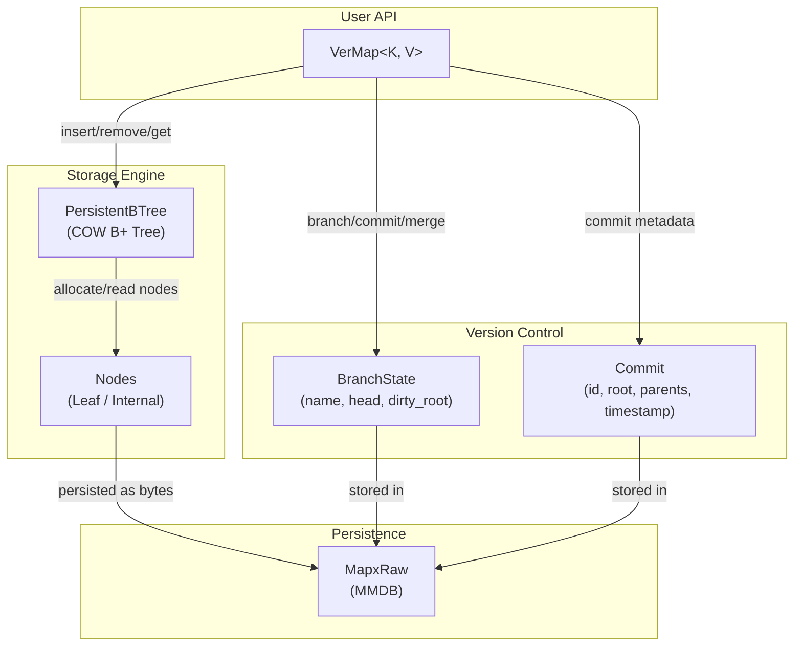

---

## Layer Architecture

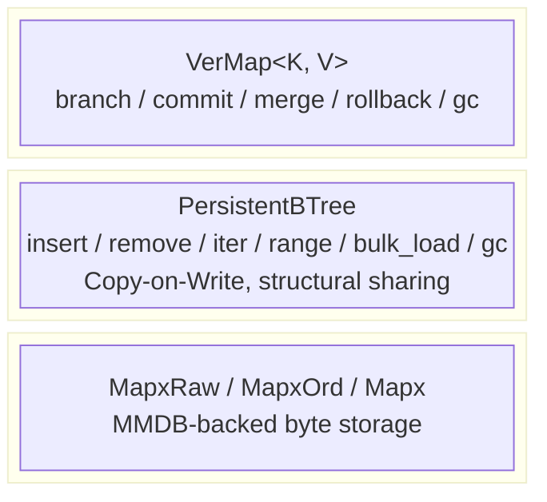

**VerMap** holds the following persistent state:

| Field | Type | Purpose |
|:------|:-----|:--------|
| `tree` | `PersistentBTree` | Shared node pool for all versions |
| `commits` | `MapxOrd<u64, Commit>` | CommitId → Commit metadata |
| `branches` | `MapxOrd<u64, BranchState>` | BranchId → branch state |
| `branch_names` | `Mapx<String, u64>` | name → BranchId lookup |
| `next_commit` | `Orphan<u64>` | monotonic CommitId allocator |
| `next_branch` | `Orphan<u64>` | monotonic BranchId allocator |
| `main_branch` | `Orphan<u64>` | protected main branch ID |

---

## Core Data Structures

### Commit

```
Commit {
    id:           CommitId  (u64),
    root:         NodeId    (B+ tree root snapshot),
    parents:      Vec<CommitId>,
    timestamp_us: u64,
    ref_count:    u32,       // branch HEADs + child parent-links
}
```

- `parents.len() == 0` → initial commit
- `parents.len() == 1` → normal linear commit
- `parents.len() == 2` → merge commit `[target_head, source_head]`

### BranchState

```
BranchState {
    name:       String,
    head:       CommitId,   // latest committed snapshot (0 = no commits yet)
    dirty_root: NodeId,     // uncommitted working-tree root
}
```

### B+ Tree Node (B = 16, max 32 keys per node)

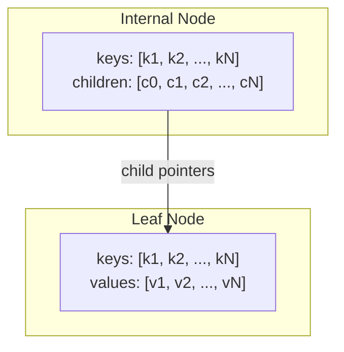

Each `NodeId` is a `u64`, monotonically allocated and never reused.
`EMPTY_ROOT = 0` is the sentinel for an empty tree.

---

## Lifecycle

### Overview

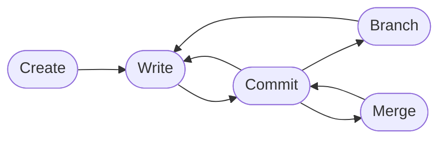

Typical flow: **create → write → commit → branch → merge**
(GC is automatic — no explicit step needed)

### Detailed Step-by-Step

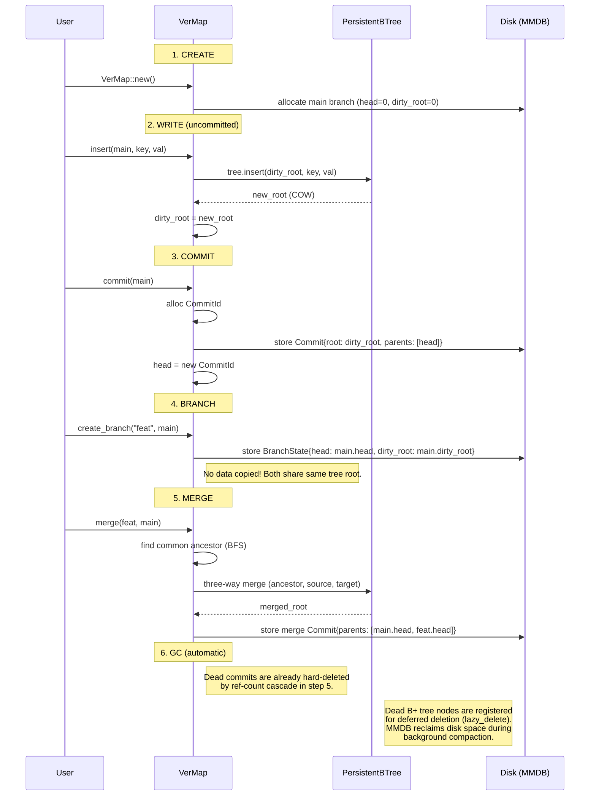

---

## Copy-on-Write & Structural Sharing

Branching is **instantaneous** — no data is physically copied.
Both branches point to the **same B+ tree root**. The first mutation
triggers copy-on-write, allocating only the modified path (~O(log n) nodes).

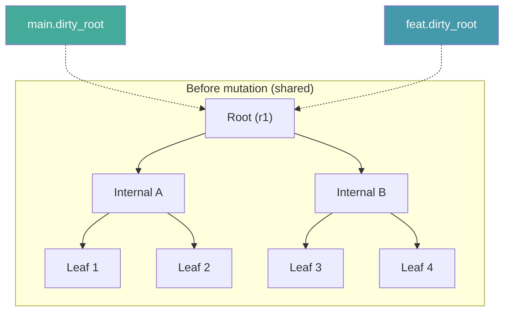

After `feat.insert(key_in_leaf3, new_val)`:

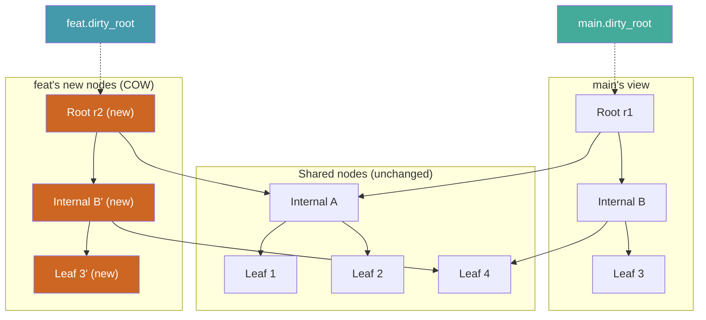

> Only 3 new nodes allocated (red). The 4 shared nodes (Internal A, Leaf 1, Leaf 2, Leaf 4) are referenced by both versions simultaneously.

---

## Commit DAG

Commits form a **Directed Acyclic Graph** via parent pointers.
Linear commits have one parent; merge commits have two.

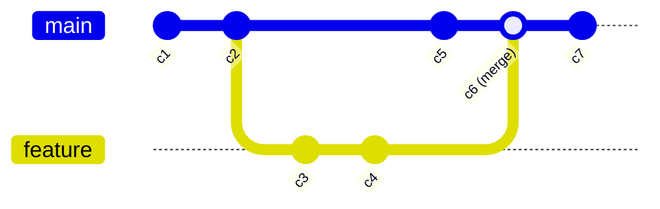

### Commit Parent Relationships

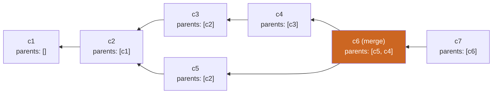

Each commit's `root` field is a **snapshot** — an immutable B+ tree root that
captures the full state of the map at that point in time.

---

## Three-Way Merge Algorithm

### Overview

`merge(source, target)` finds the common ancestor, then resolves every key
across all three versions:

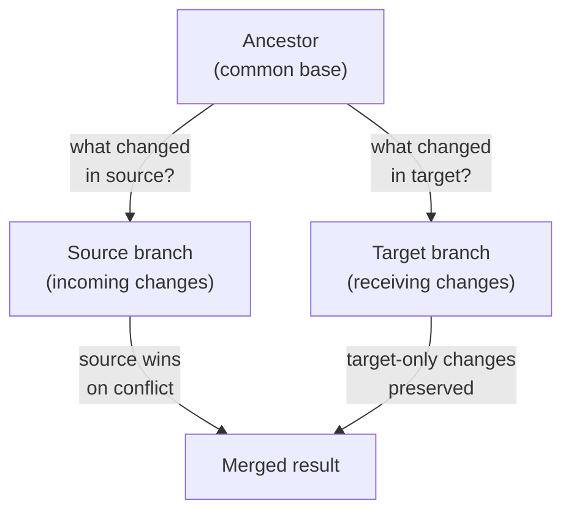

### Fast Paths

Before running the full algorithm, three fast paths are checked:

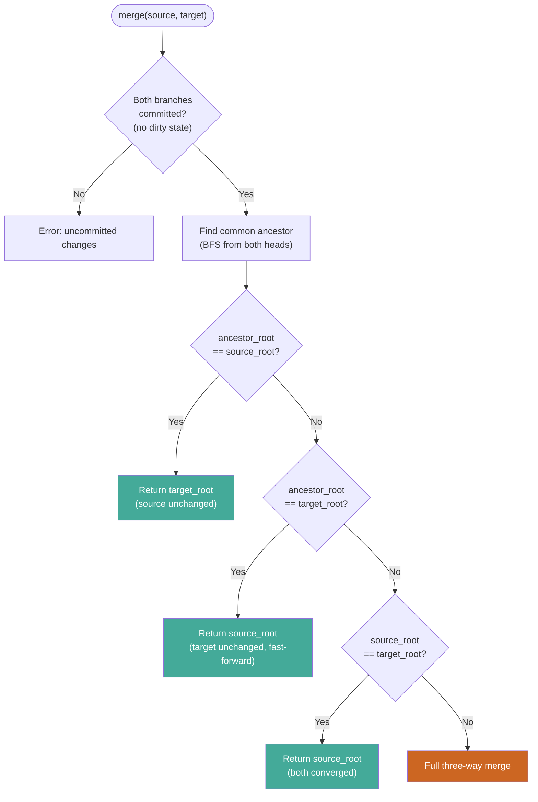

### Full Three-Way Merge Process

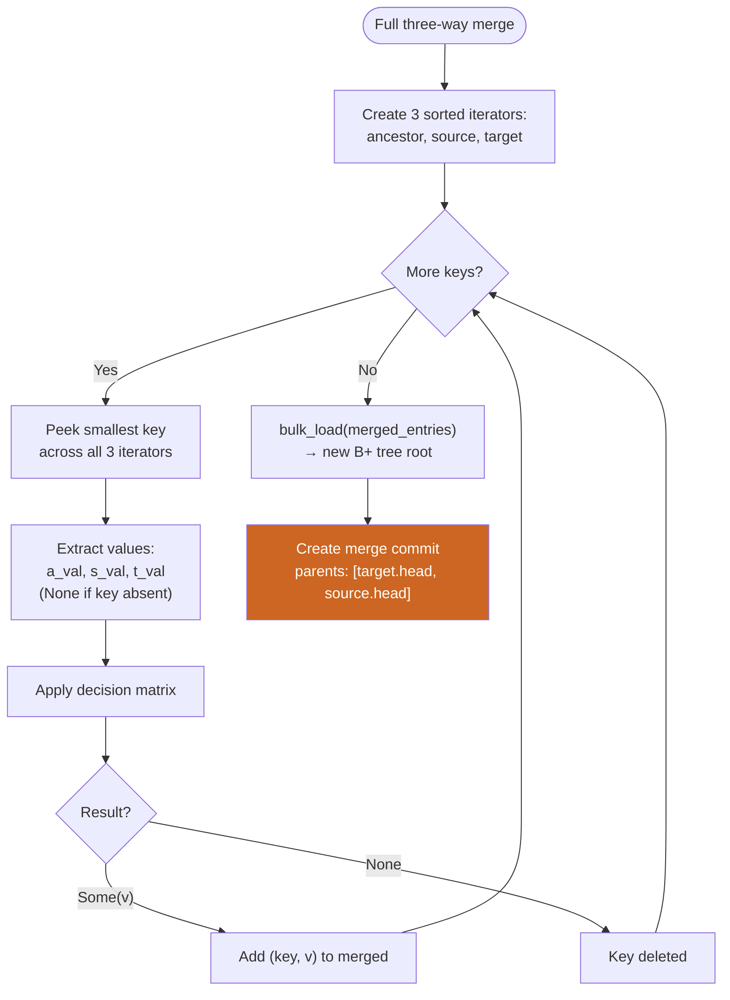

### Conflict Resolution Matrix

> **Rule: Source wins on conflict.**

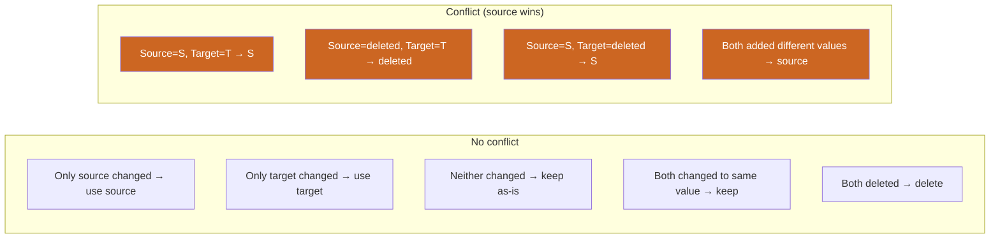

Full table:

| Ancestor | Source | Target | Result | Type |
|:---------|:-------|:-------|:-------|:-----|
| A | A | A | A | no change |
| A | **S** | A | **S** | source-only |
| A | A | **T** | **T** | target-only |
| A | **S** | **S** | **S** | both same |
| A | **S** | **T** | **S** | conflict → source wins |
| A | _deleted_ | A | _deleted_ | source-only delete |
| A | A | _deleted_ | _deleted_ | target-only delete |
| A | _deleted_ | **T** | _deleted_ | conflict → source wins |
| A | **S** | _deleted_ | **S** | conflict → source wins |
| A | _deleted_ | _deleted_ | _deleted_ | both deleted |
| _absent_ | **S** | _absent_ | **S** | source-only add |
| _absent_ | _absent_ | **T** | **T** | target-only add |
| _absent_ | **S** | **S** | **S** | both added same |
| _absent_ | **S** | **T** | **S** | conflict → source wins |

The caller controls priority by choosing which branch to pass as `source` vs `target`.

---

## Garbage Collection

**Users do not need to call `gc()` in normal operation.**  Both commit
cleanup and B+ tree disk reclamation happen automatically.

### How It Works

Lifecycle management is split into two layers, both fully automatic:

1. **Commit ref counting** — each `Commit` tracks a `ref_count`
   (branch HEADs + child parent-links).  When a branch is deleted or
   rolled back, commits whose `ref_count` drops to zero are
   **immediately hard-deleted** via cascading decrement.

2. **B+ tree node ref counting + lazy deletion** — `PersistentBTree`
   maintains an in-memory `HashMap<NodeId, NodeRef>` that tracks
   per-node reference counts.  When a commit root is released and a
   node's count reaches zero, it is:
   - cascade-removed from the in-memory ref map, **and**
   - registered for deferred disk deletion via the MMDB storage
     engine's compaction filter (`lazy_delete`).

   The underlying MMDB engine reclaims disk space during background
   compaction — no user action required.

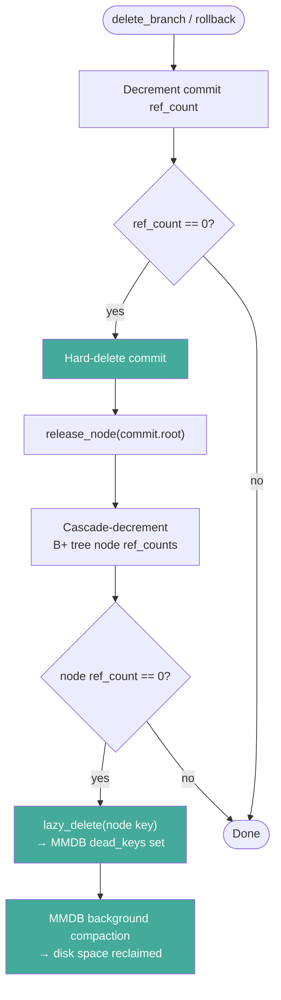

### When to Call `gc()` Explicitly

`gc()` is still available for two edge cases:

- **Crash recovery** — if a ref-count cascade was interrupted
  (`gc_dirty` flag set), `gc()` rebuilds all commit ref counts from
  scratch and removes orphaned commits.
- **Forced full sweep** — guarantees every unreachable node is
  registered for compaction, even if a prior cascade was incomplete.

### Example

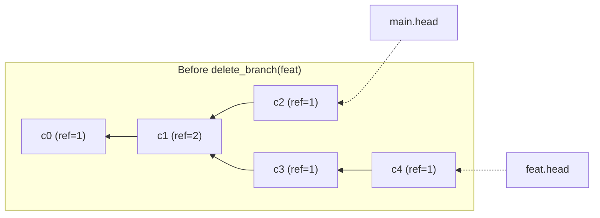

After `delete_branch(feat)`:
- Ref-count cascade immediately deletes **c4** (ref 1→0) and
  **c3** (ref 1→0).
- **c1** drops from ref=2 to ref=1 (still alive via c2).
- B+ tree nodes from c3/c4 are released from the in-memory ref map
  **and** registered for deferred disk deletion via `lazy_delete`.
- MMDB background compaction reclaims disk space automatically.

---

## Fork Point & Commit Distance

These APIs support divergent-branch detection.

### Fork Point

`fork_point(a, b)` finds the **lowest common ancestor** of two commits.

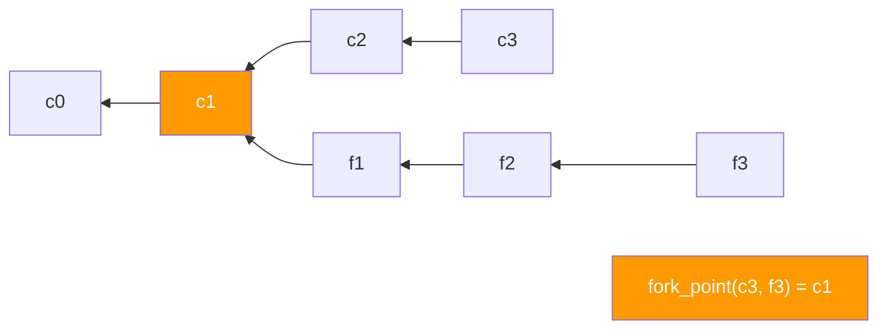

### Commit Distance

`commit_distance(from, ancestor)` counts hops on the **first-parent chain** only.

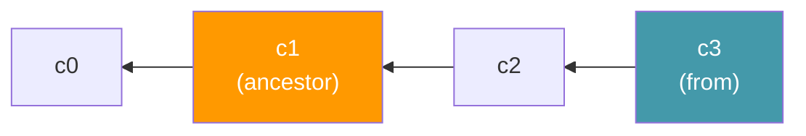

```
commit_distance(c3, c1) = 2    (c3 → c2 → c1, two hops)
```

Combined example:

```
Main:    c0 → c1 → c2 → c3
Fork:    c0 → c1 → f1 → f2 → f3 → f4

fork_point(c3, f4)       = c1
commit_distance(c3, c1)  = 2
commit_distance(f4, c1)  = 4
```

---

## Rollback & Discard

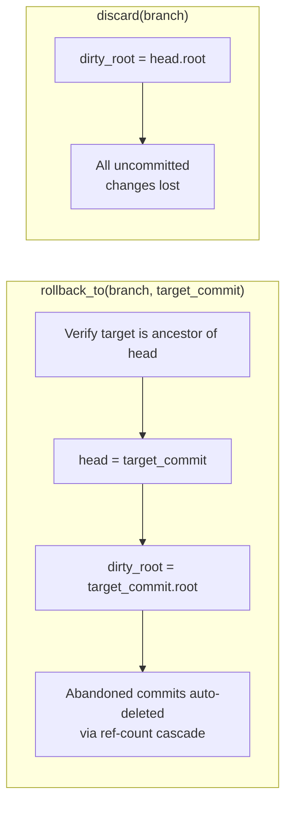

---

## Summary

| Concept | Mechanism |
|:--------|:----------|
| **Versioning** | Each commit snapshots a B+ tree root |
| **Branching** | Copies only a lightweight `BranchState` struct |
| **Isolation** | Each branch has independent `head` + `dirty_root` |
| **Structural sharing** | COW B+ tree — mutations allocate ~O(log n) nodes |
| **Merge** | Three-way with sorted iterators; source wins on conflict |
| **GC** | Fully automatic — commit ref counting + B+ tree lazy deletion via MMDB compaction; `gc()` only for crash recovery |
| **Persistence** | All state stored in MMDB via `MapxRaw` |
