# Versioned Module — Architecture & Internals

This document explains the design, data flow, and internal mechanisms of `VerMap`,
the Git-model versioned storage engine in `vsdb`.

---

## Table of Contents

- [Architecture Overview](#architecture-overview)
- [Layer Architecture](#layer-architecture)
- [Core Data Structures](#core-data-structures)
- [Lifecycle: Create → Write → Commit → Branch → Merge](#lifecycle)
- [Copy-on-Write & Structural Sharing](#copy-on-write--structural-sharing)
- [Commit DAG](#commit-dag)
- [Three-Way Merge Algorithm](#three-way-merge-algorithm)
- [Durability and Recovery](#durability-and-recovery)
- [Garbage Collection](#garbage-collection)
- [Fork Point & Commit Distance](#fork-point--commit-distance)

---

## Architecture Overview

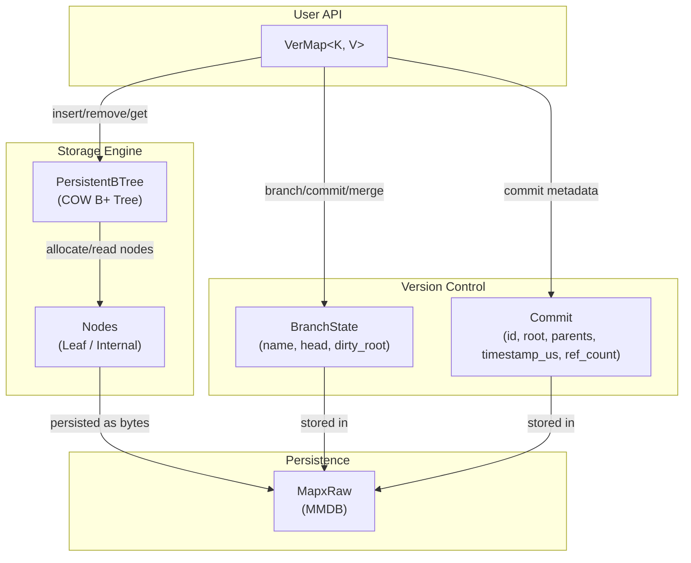
```mermaid
graph TB
    subgraph "User API"
        VM["VerMap&lt;K, V&gt;"]
    end

    subgraph "Version Control"
        BR["BranchState<br/>(name, head, dirty_root)"]
        CM["Commit<br/>(id, root, parents, timestamp_us, ref_count)"]
    end

    subgraph "Storage Engine"
        BT["PersistentBTree<br/>(COW B+ Tree)"]
        ND["Nodes<br/>(Leaf / Internal)"]
    end

    subgraph "Persistence"
        MR["MapxRaw<br/>(MMDB)"]
    end

    VM -->|"branch/commit/merge"| BR
    VM -->|"commit metadata"| CM
    VM -->|"insert/remove/get"| BT
    BT -->|"allocate/read nodes"| ND
    ND -->|"persisted as bytes"| MR
    BR -->|"stored in"| MR
    CM -->|"stored in"| MR
```

---

## Layer Architecture

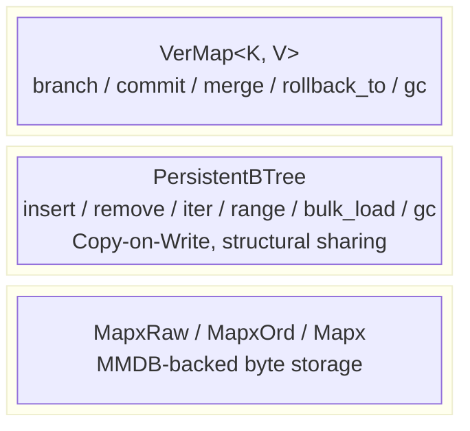
```mermaid
block-beta
    columns 1
    block:L1["Layer 1 — User-Facing API"]
        A["VerMap&lt;K, V&gt;<br/>branch / commit / merge / rollback_to / gc"]
    end
    block:L2["Layer 2 — Persistent B+ Tree"]
        B["PersistentBTree<br/>insert / remove / iter / range / bulk_load / gc<br/>Copy-on-Write, structural sharing"]
    end
    block:L3["Layer 3 — Raw KV Storage"]
        C["MapxRaw / MapxOrd / Mapx<br/>MMDB-backed byte storage"]
    end
```

**VerMap** holds the following persistent state:

| Field | Type | Purpose |
|:------|:-----|:--------|
| `tree` | `PersistentBTree` | Shared node pool for all versions |
| `commits` | `MapxOrd<u64, Commit>` | CommitId → Commit metadata |
| `branches` | `MapxOrd<u64, BranchState>` | BranchId → branch state |
| `branch_names` | `Mapx<String, u64>` | name → BranchId lookup |
| `next_commit` | `Orphan<u64>` | monotonic CommitId allocator |
| `next_branch` | `Orphan<u64>` | monotonic BranchId allocator |
| `main_branch` | `Orphan<u64>` | protected main branch ID |
| `gc_dirty` | `Orphan<bool>` | crash-recovery/ref-count repair flag |

---

## Core Data Structures

`BranchId` and `CommitId` are distinct serde-transparent `u64` newtypes.
Persisted component table keys remain `u64` for v16 handle compatibility.

### Commit

```
Commit {
    id:           CommitId  (transparent u64 newtype),
    root:         NodeId    (B+ tree root snapshot),
    parents:      Vec<CommitId>,
    timestamp_us: u64,
    ref_count:    u32,       // branch HEADs + child parent-links
}
```

- `parents.len() == 0` → initial commit
- `parents.len() == 1` → normal linear commit
- `parents.len() == 2` → merge commit `[target_head, source_head]`

### BranchState

```
BranchState {
    name:       String,
    head:       CommitId,   // latest committed snapshot (0 = no commits yet)
    dirty_root: NodeId,     // uncommitted working-tree root
}
```

### B+ Tree Node (B = 16, max 32 keys per node)

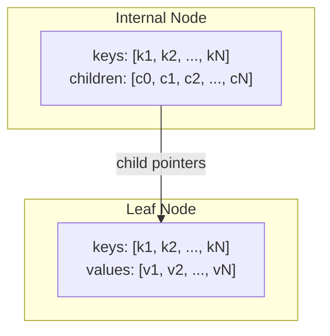
```mermaid
graph TB
    subgraph "Internal Node"
        I["keys: [k1, k2, ..., kN]<br/>children: [c0, c1, c2, ..., cN]"]
    end
    subgraph "Leaf Node"
        L["keys:   [k1, k2, ..., kN]<br/>values: [v1, v2, ..., vN]"]
    end

    I -->|"child pointers"| L
```

Each `NodeId` is a `u64`, monotonically allocated and never reused.
`EMPTY_ROOT = 0` is the sentinel for an empty tree.

---

## Lifecycle

### Overview

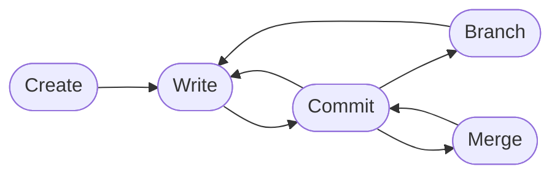
```mermaid
graph LR
    A(["Create"]) --> B(["Write"])
    B --> C(["Commit"])
    C --> B
    C --> D(["Branch"])
    D --> B
    C --> E(["Merge"])
    E --> C
```

Typical flow: **create → write → commit → branch → merge**
(GC is automatic — no explicit step needed)

### Detailed Step-by-Step

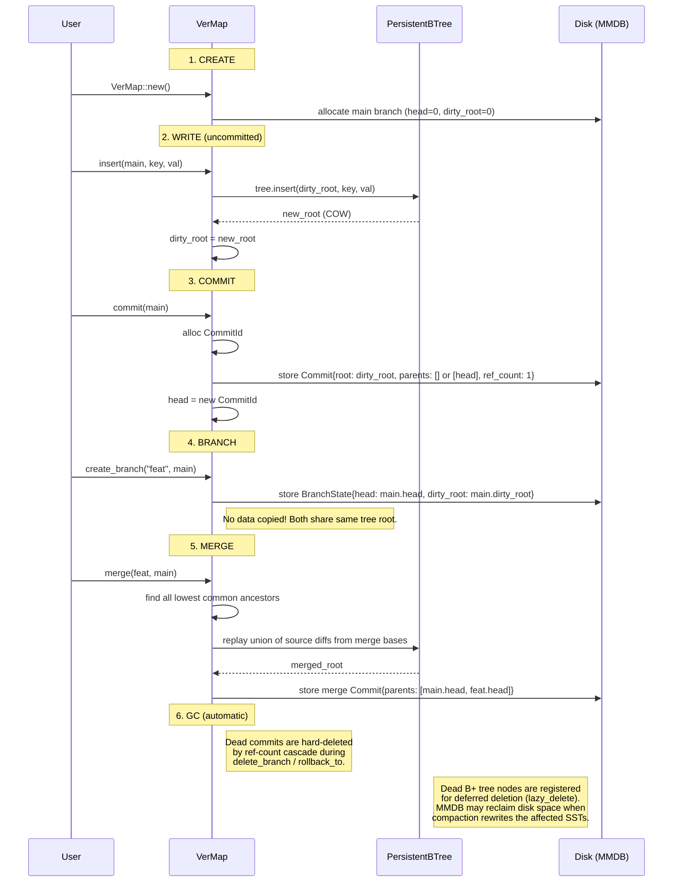
```mermaid
sequenceDiagram
    participant U as User
    participant V as VerMap
    participant T as PersistentBTree
    participant D as Disk (MMDB)

    Note over V: 1. CREATE
    U->>V: VerMap::new()
    V->>D: allocate main branch (head=0, dirty_root=0)

    Note over V: 2. WRITE (uncommitted)
    U->>V: insert(main, key, val)
    V->>T: tree.insert(dirty_root, key, val)
    T-->>V: new_root (COW)
    V->>V: dirty_root = new_root

    Note over V: 3. COMMIT
    U->>V: commit(main)
    V->>V: alloc CommitId
    V->>D: store Commit{root: dirty_root, parents: [] or [head], ref_count: 1}
    V->>V: head = new CommitId

    Note over V: 4. BRANCH
    U->>V: create_branch("feat", main)
    V->>D: store BranchState{head: main.head, dirty_root: main.dirty_root}
    Note right of V: No data copied! Both share same tree root.

    Note over V: 5. MERGE
    U->>V: merge(feat, main)
    V->>V: find all lowest common ancestors
    V->>T: replay union of source diffs from merge bases
    T-->>V: merged_root
    V->>D: store merge Commit{parents: [main.head, feat.head]}

    Note over V: 6. GC (automatic)
    Note right of V: Dead commits are hard-deleted<br/>by ref-count cascade during<br/>delete_branch / rollback_to.
    Note right of T: Dead B+ tree nodes are registered<br/>for deferred deletion (lazy_delete).<br/>MMDB may reclaim disk space when<br/>compaction rewrites the affected SSTs.
```

---

## Copy-on-Write & Structural Sharing

Branching copies only branch metadata and retains existing roots; it does not
copy entries. The operation still performs writes and a durability sync.
Both branches point to the **same B+ tree root**. The first mutation
triggers copy-on-write, allocating only the modified path (~O(log n) nodes).

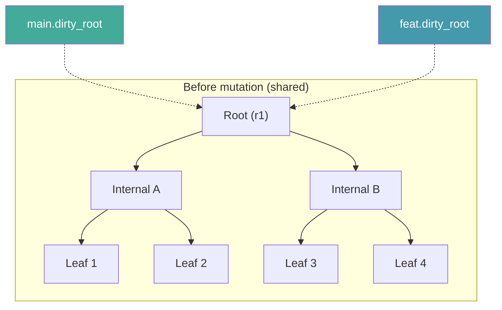
```mermaid
graph TB
    subgraph "Before mutation (shared)"
        R1["Root (r1)"]
        I1["Internal A"]
        I2["Internal B"]
        L1["Leaf 1"]
        L2["Leaf 2"]
        L3["Leaf 3"]
        L4["Leaf 4"]

        R1 --> I1
        R1 --> I2
        I1 --> L1
        I1 --> L2
        I2 --> L3
        I2 --> L4
    end

    MH["main.dirty_root"] -.-> R1
    FH["feat.dirty_root"] -.-> R1

    style MH fill:#4a9,color:#fff
    style FH fill:#49a,color:#fff
```

After `feat.insert(key_in_leaf3, new_val)`:

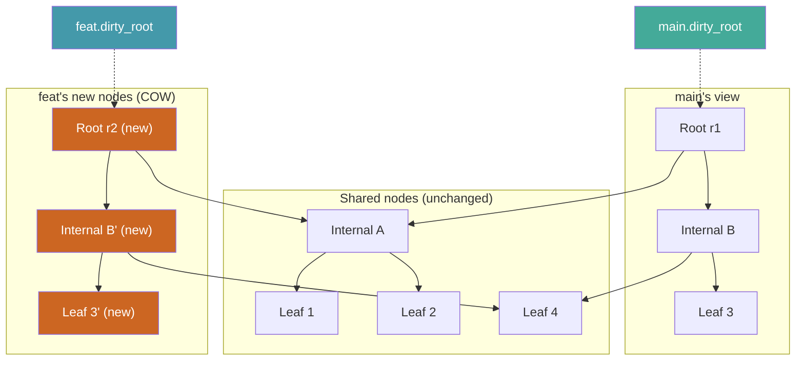
```mermaid
graph TB
    subgraph "Shared nodes (unchanged)"
        I1["Internal A"]
        L1["Leaf 1"]
        L2["Leaf 2"]
        L4["Leaf 4"]
        I1 --> L1
        I1 --> L2
    end

    subgraph "main's view"
        R1["Root r1"]
        I2["Internal B"]
        L3["Leaf 3"]
        R1 --> I1
        R1 --> I2
        I2 --> L3
        I2 --> L4
    end

    subgraph "feat's new nodes (COW)"
        R2["Root r2 (new)"]
        I3["Internal B' (new)"]
        L5["Leaf 3' (new)"]
        R2 --> I1
        R2 --> I3
        I3 --> L5
        I3 --> L4
    end

    MH["main.dirty_root"] -.-> R1
    FH["feat.dirty_root"] -.-> R2

    style R2 fill:#c62,color:#fff
    style I3 fill:#c62,color:#fff
    style L5 fill:#c62,color:#fff
    style MH fill:#4a9,color:#fff
    style FH fill:#49a,color:#fff
```

> Only 3 new nodes allocated (red). The 4 shared nodes (Internal A, Leaf 1, Leaf 2, Leaf 4) are referenced by both versions simultaneously.

---

## Commit DAG

Commits form a **Directed Acyclic Graph** via parent pointers.
Linear commits have one parent; merge commits have two.

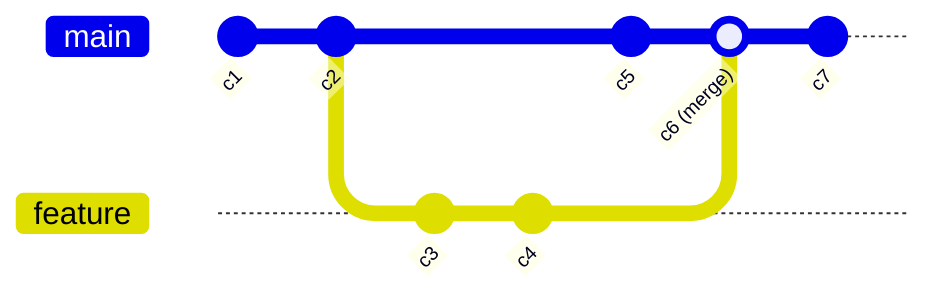
```mermaid
gitGraph
    commit id: "c1"
    commit id: "c2"
    branch feature
    commit id: "c3"
    commit id: "c4"
    checkout main
    commit id: "c5"
    merge feature id: "c6 (merge)"
    commit id: "c7"
```

### Commit Parent Relationships

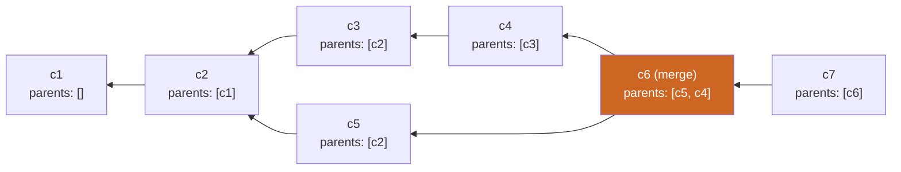
```mermaid
graph RL
    c1["c1<br/>parents: []"]
    c2["c2<br/>parents: [c1]"]
    c5["c5<br/>parents: [c2]"]
    c3["c3<br/>parents: [c2]"]
    c4["c4<br/>parents: [c3]"]
    c6["c6 (merge)<br/>parents: [c5, c4]"]
    c7["c7<br/>parents: [c6]"]

    c2 --> c1
    c3 --> c2
    c4 --> c3
    c5 --> c2
    c6 --> c5
    c6 --> c4
    c7 --> c6

    style c6 fill:#c62,color:#fff
```

Each commit's `root` field is a **snapshot** — an immutable B+ tree root that
captures the full state of the map at that point in time.

`at(commit)` and `snapshot(branch)` return a read-only view that retains its
captured tree root. Later changes through a restored alias, including rollback
and branch deletion, do not change the view. Its iterators share that retention
and can outlive the view itself. Capturing a view updates only runtime ownership;
it does not write persistent state or copy entries. Iteration remains streaming.

A view keeps its tree nodes alive until it and all its iterators are dropped. It
does not keep the commit record or branch alive, so a later `at(commit)` can fail
for a deleted commit even while an existing view still reads its contents.

---

## Three-Way Merge Algorithm

### Overview

`merge(&mut self, source: BranchId, target: BranchId) -> Result<CommitId>`
finds all lowest common ancestors (merge bases) and replays source changes
onto the target. It rejects self-merge, uncommitted source or target branches,
and a source branch with no commits. Equal heads return the existing commit.
An empty target fast-forwards to the source head; every other successful merge
creates a two-parent commit, even when it can reuse an existing tree root.

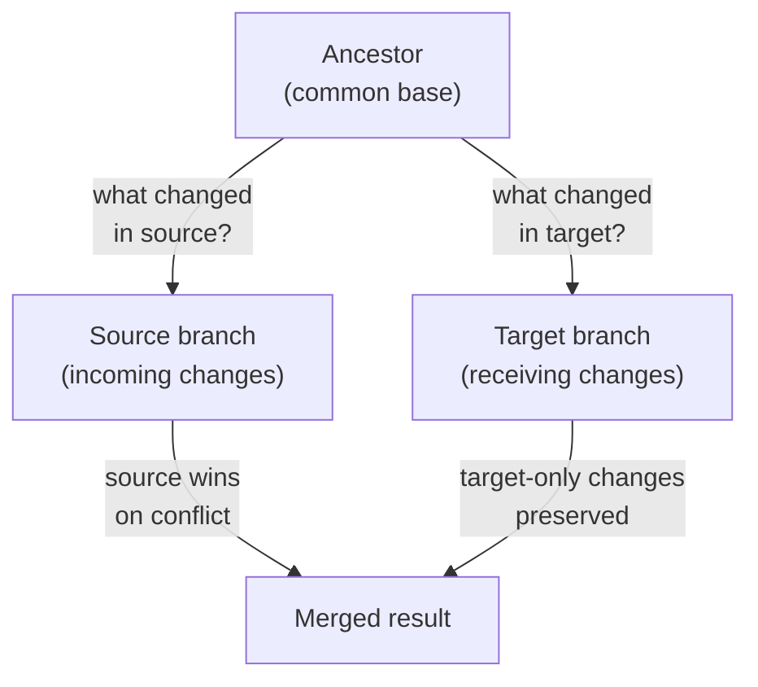
```mermaid
graph TB
    A["Ancestor<br/>(common base)"]
    S["Source branch<br/>(incoming changes)"]
    T["Target branch<br/>(receiving changes)"]
    M["Merged result"]

    A -->|"what changed<br/>in source?"| S
    A -->|"what changed<br/>in target?"| T
    S -->|"source wins<br/>on conflict"| M
    T -->|"target-only changes<br/>preserved"| M
```

### Tree-root fast paths

For a single merge base, the B+ tree layer can reuse roots as follows. These
are tree-state shortcuts, not branch-history fast-forwards: the public
`VerMap::merge` still follows the commit rules above. Multiple merge bases
use the union of their source diffs.

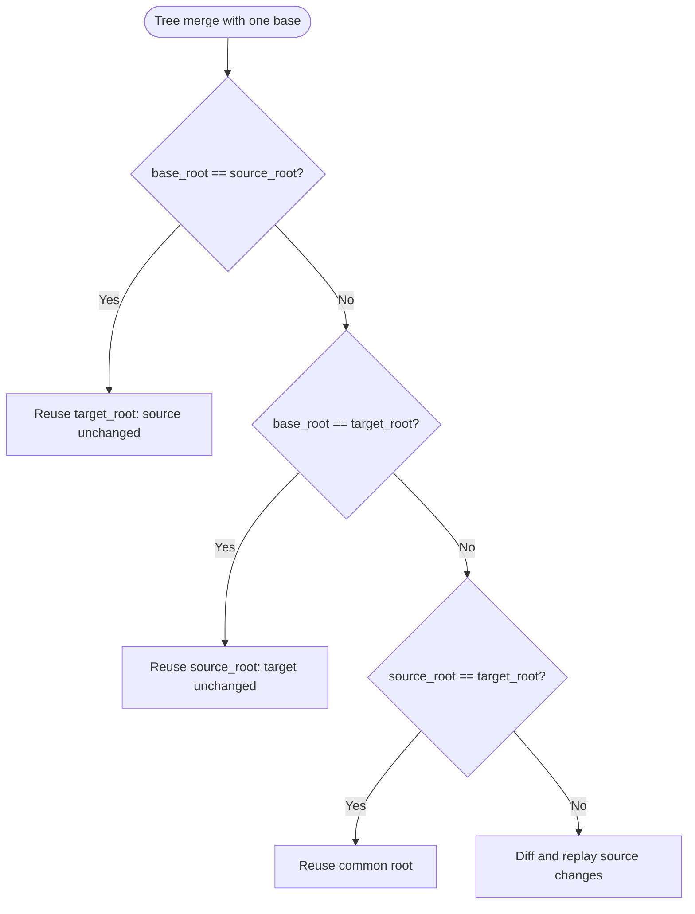
```mermaid
flowchart TD
    Start(["Tree merge with one base"]) --> FP1{"base_root == source_root?"}
    FP1 -->|Yes| KeepT["Reuse target_root: source unchanged"]
    FP1 -->|No| FP2{"base_root == target_root?"}
    FP2 -->|Yes| KeepS["Reuse source_root: target unchanged"]
    FP2 -->|No| FP3{"source_root == target_root?"}
    FP3 -->|Yes| Same["Reuse common root"]
    FP3 -->|No| Full["Diff and replay source changes"]
```

### Full Three-Way Merge Process

Every row of the conflict matrix below reduces to one rule: a key whose
source state differs from the ancestor takes the source state; every other
key keeps the target state. The merge therefore replays the source-side
delta onto the target tree instead of rebuilding it:

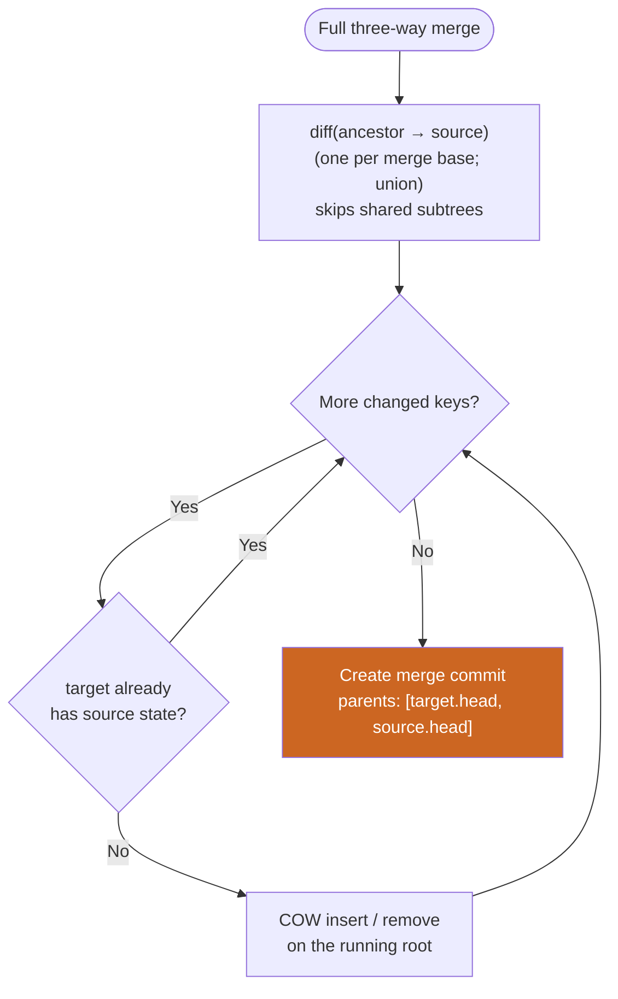
```mermaid
flowchart TD
    Start(["Full three-way merge"]) --> Diff["diff(ancestor → source)<br/>(one per merge base; union)<br/>skips shared subtrees"]
    Diff --> Loop{"More changed keys?"}
    Loop -->|Yes| Same{"target already<br/>has source state?"}
    Same -->|Yes| Loop
    Same -->|No| Apply["COW insert / remove<br/>on the running root"]
    Apply --> Loop
    Loop -->|No| MergeCommit["Create merge commit<br/>parents: [target.head, source.head]"]

    style MergeCommit fill:#c62,color:#fff
```

Diff skips subtrees with identical NodeIds. With structural sharing, this
limits work to changed paths; independently built trees can require a full
walk even when their contents match. Replay updates only the source delta
(roughly changed keys × tree depth), retaining unaffected subtrees. Finding
merge bases also walks commit history. All replay steps share one write
buffer, discarding intermediate versions before they reach the engine.
`diff_commits` / `diff_uncommitted` use the same shared-subtree skipping walk.

### Conflict Resolution Matrix

> **Rule: Source wins on conflict.**

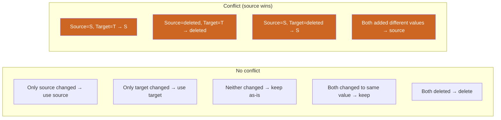
```mermaid
graph LR
    subgraph "No conflict"
        NC1["Only source changed → use source"]
        NC2["Only target changed → use target"]
        NC3["Neither changed → keep as-is"]
        NC4["Both changed to same value → keep"]
        NC5["Both deleted → delete"]
    end

    subgraph "Conflict (source wins)"
        C1["Source=S, Target=T → S"]
        C2["Source=deleted, Target=T → deleted"]
        C3["Source=S, Target=deleted → S"]
        C4["Both added different values → source"]
    end

    style C1 fill:#c62,color:#fff
    style C2 fill:#c62,color:#fff
    style C3 fill:#c62,color:#fff
    style C4 fill:#c62,color:#fff
```

Full table:

| Ancestor | Source | Target | Result | Type |
|:---------|:-------|:-------|:-------|:-----|
| A | A | A | A | no change |
| A | **S** | A | **S** | source-only |
| A | A | **T** | **T** | target-only |
| A | **S** | **S** | **S** | both same |
| A | **S** | **T** | **S** | conflict → source wins |
| A | _deleted_ | A | _deleted_ | source-only delete |
| A | A | _deleted_ | _deleted_ | target-only delete |
| A | _deleted_ | **T** | _deleted_ | conflict → source wins |
| A | **S** | _deleted_ | **S** | conflict → source wins |
| A | _deleted_ | _deleted_ | _deleted_ | both deleted |
| _absent_ | **S** | _absent_ | **S** | source-only add |
| _absent_ | _absent_ | **T** | **T** | target-only add |
| _absent_ | **S** | **S** | **S** | both added same |
| _absent_ | **S** | **T** | **S** | conflict → source wins |

The caller controls priority by choosing which branch to pass as `source` vs `target`.

---

## Durability and Recovery

A VerMap is eight components (node pool, commits, branches, branch names,
two ID allocators, the main pointer, and the `gc_dirty` flag). The ordering
rules below keep every crash state recoverable:

1. Advance an ID allocator before publishing its new ID.
2. Write new tree nodes before publishing a root in a commit or branch.
3. Write a new commit record before publishing a branch HEAD that names it.
4. Remove branch/commit references before their tree roots become eligible
   for physical reclamation.
5. Set `gc_dirty = true` before count changes, and clear it only after the
   completed metadata changes.

**Co-located layout (maps created by v16.3.11+, and every deep clone).** All
components are allocated on the node pool's engine shard, so they share one
WAL: its program order *is* the crash order (a crash keeps a prefix), and
rules 1–5 need no fsync. Working-state operations (`insert`, `remove`,
`discard`) issue no sync at all; history operations (`commit`, `merge`,
`create_branch`, `delete_branch`, `rollback_to`, `set_main_branch`) end with
one WAL sync, so they are durable when they return. Nodes released by an
operation are registered for physical deletion only after the next such sync
(or once the release queue grows large), so compaction can never delete nodes
that a not-yet-durable operation stopped referencing. An unregistered release
is not a leak: the next restore's sweep reclaims every unreachable node. The
release queue is shared by restored aliases and their live views. Dropping the
last view or iterator can queue more nodes; those entries wait for the next
sync and registration, or a later recovery sweep.

**Per-shard layout (maps created by earlier versions).** Components occupy
different shards, each with its own WAL, so an atomic node batch alone does
not order its durability against a branch or commit record. Every rule above
is enforced by synchronizing the relevant shard WAL at that boundary (no
namespace-wide memtable flush). Such maps keep working unchanged; `clone()`
produces a co-located copy.

New maps and deep clones synchronize their initialized component graph before
returning. A deep clone has independent ownership and does not inherit views of
the original map.

Recovery validates every branch HEAD and reachable commit parent before any
orphan cleanup, including when the dirty flag is clear. A missing reachable
commit causes restoration to fail instead of deleting older history as
unreachable. `gc()` fails before deleting commits on the same incomplete graph.
These checks cannot reconstruct records already lost by older versions: preserve
a damaged dataset and recover from a complete backup.

Read-only restoration performs the validation and rebuilds runtime state without
writing WAL fences or repair metadata. See the [read-only guide](read-only.md)
for preparing snapshots that require maintenance recovery.

---

## Garbage Collection

**Users do not need to call `gc()` in normal operation.** Commit cleanup and
node-retirement scheduling are automatic. Physical disk reclamation is
best-effort and depends on which SSTs MMDB compaction rewrites.

### How It Works

Lifecycle management has two layers:

1. **Commit ref counting** — each `Commit` tracks a `ref_count`
   (branch HEADs + child parent-links).  When a branch is deleted or
   rolled back, commits whose `ref_count` drops to zero are
   **immediately hard-deleted** via cascading decrement.

2. **B+ tree node ref counting + lazy deletion** — `PersistentBTree`
   maintains an in-memory `HashMap<NodeId, NodeRef>` that tracks
   per-node reference counts shared by aliases. Roots are owned by commits,
   branch working states, and live view leases. Both recovery and `gc()`
   preserve these leases. When an owner releases its root and a node's
   count reaches zero, it is:
   - cascade-removed from the in-memory ref map, **and**
   - queued for deferred disk deletion. After the root-removal writes are
     fenced, the queue registers keys with MMDB `lazy_delete`.

   Background compaction can reclaim these keys when it rewrites their SSTs.
   Cold data may remain on disk indefinitely; neither registration nor `gc()`
   promises prompt physical reclamation.

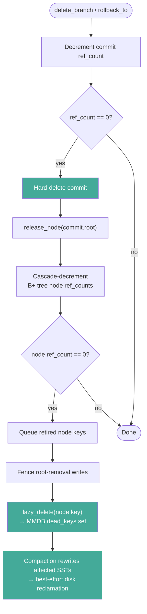
```mermaid
flowchart TD
    Start(["delete_branch / rollback_to"]) --> RC["Decrement commit ref_count"]
    RC --> Dead{"ref_count == 0?"}
    Dead -->|yes| Del["Hard-delete commit"]
    Del --> Rel["release_node(commit.root)"]
    Rel --> NodeRC["Cascade-decrement<br/>B+ tree node ref_counts"]
    NodeRC --> NodeDead{"node ref_count == 0?"}
    NodeDead -->|yes| Queue["Queue retired node keys"]
    Queue --> Fence["Fence root-removal writes"]
    Fence --> Lazy["lazy_delete(node key)<br/>→ MMDB dead_keys set"]
    Lazy --> Compact["Compaction rewrites affected SSTs<br/>→ best-effort disk reclamation"]
    Dead -->|no| Done(["Done"])
    NodeDead -->|no| Done

    style Del fill:#4a9,color:#fff
    style Lazy fill:#4a9,color:#fff
    style Compact fill:#4a9,color:#fff
```

### When to Call `gc()` Explicitly

`gc()` is still available for two edge cases:

- **Crash recovery** — if a ref-count cascade was interrupted
  (`gc_dirty` flag set), `gc()` rebuilds all commit ref counts from
  scratch and removes orphaned commits.
- **Forced full sweep** — guarantees every unreachable node is
  registered for compaction, even if a prior cascade was incomplete.

### Example

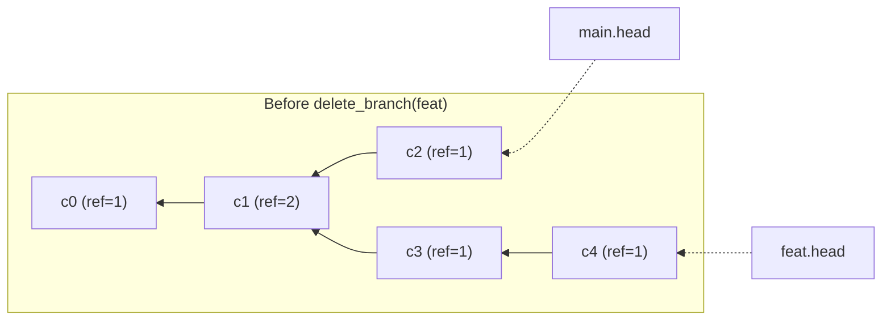
```mermaid
graph RL
    subgraph "Before delete_branch(feat)"
        c1["c1 (ref=2)"] --> c0["c0 (ref=1)"]
        c2["c2 (ref=1)"] --> c1
        c3["c3 (ref=1)"] --> c1
        c4["c4 (ref=1)"] --> c3
    end

    MAIN["main.head"] -.-> c2
    FEAT["feat.head"] -.-> c4
```

After `delete_branch(feat)`:
- Ref-count cascade immediately deletes **c4** (ref 1→0) and
  **c3** (ref 1→0).
- **c1** drops from ref=2 to ref=1 (still alive via c2).
- B+ tree nodes from c3/c4 with no remaining owner (including live views)
  are released from the in-memory ref map, then queued and registered for
  `lazy_delete` after the required durability fence.
- MMDB can reclaim their disk space when compaction rewrites the affected SSTs.

---

## Fork Point & Commit Distance

These APIs support divergent-branch detection.

### Fork Point

`fork_point(a, b)` returns one **lowest common ancestor**. If criss-cross
history has several merge bases, it selects the greatest CommitId among them;
`merge` itself considers all bases. It returns `None` when no common ancestor
is found.

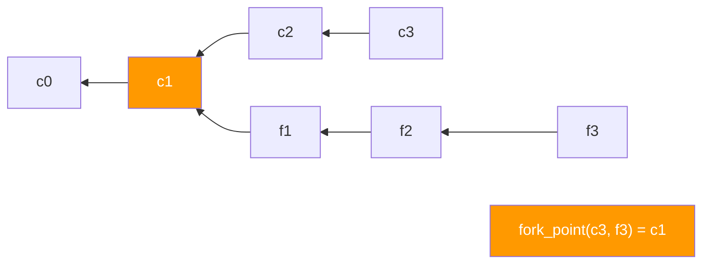
```mermaid
graph RL
    c0["c0"]
    c1["c1"] --> c0
    c2["c2"] --> c1
    c3["c3"] --> c2
    f1["f1"] --> c1
    f2["f2"] --> f1
    f3["f3"] --> f2

    LCA["fork_point(c3, f3) = c1"]

    style c1 fill:#f90,color:#fff
    style LCA fill:#f90,color:#fff
```

### Commit Distance

`commit_distance(from, ancestor)` counts hops on the **first-parent chain** only.

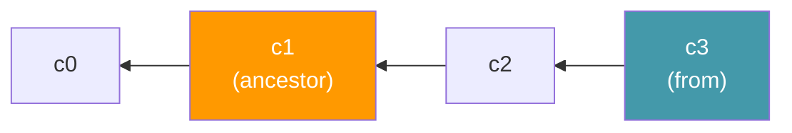
```mermaid
graph RL
    c0["c0"]
    c1["c1<br/>(ancestor)"] --> c0
    c2["c2"] --> c1
    c3["c3<br/>(from)"] --> c2

    style c1 fill:#f90,color:#fff
    style c3 fill:#49a,color:#fff
```

```
commit_distance(c3, c1) = 2    (c3 → c2 → c1, two hops)
```

Combined example:

```
Main:    c0 → c1 → c2 → c3
Fork:    c0 → c1 → f1 → f2 → f3 → f4

fork_point(c3, f4)       = c1
commit_distance(c3, c1)  = 2
commit_distance(f4, c1)  = 4
```

---

## Rollback & Discard

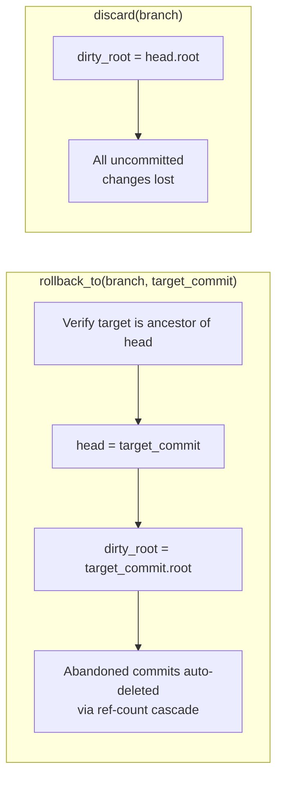
```mermaid
flowchart LR
    subgraph "rollback_to(branch, target_commit)"
        R1["Verify target is ancestor of head"] --> R2["head = target_commit"]
        R2 --> R3["dirty_root = target_commit.root"]
        R3 --> R4["Abandoned commits auto-deleted<br/>via ref-count cascade"]
    end

    subgraph "discard(branch)"
        D1["dirty_root = head.root"] --> D2["All uncommitted<br/>changes lost"]
    end
```

---

## Summary

| Concept | Mechanism |
|:--------|:----------|
| **Versioning** | Each commit snapshots a B+ tree root |
| **Branching** | Copies only a lightweight `BranchState` struct |
| **Isolation** | Each branch has independent `head` + `dirty_root` |
| **Structural sharing** | COW B+ tree — mutations allocate ~O(log n) nodes |
| **Merge** | All merge bases, shared-subtree diff, and source-delta replay; source wins on conflict |
| **GC** | Automatic ref-count cleanup and fenced node retirement; physical compaction reclaim is best-effort. `gc()` supports repair/full node sweeps |
| **Persistence** | All state stored in MMDB via `MapxRaw` |
